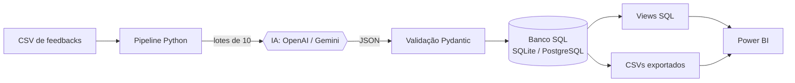
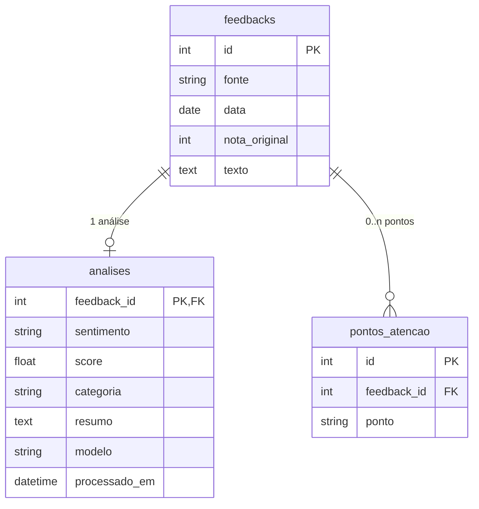

<div align="center">

# 🧠 Feedback Insights — Pipeline de Análise de Feedbacks com IA

**Transforma feedbacks em texto livre em indicadores acionáveis: sentimento, temas e pontos de atenção.**


</div>

---

## 📌 Sobre o projeto

Empresas de fitness e bem-estar recebem centenas de avaliações em texto livre (academias, apps de corrida, apps de meditação), e lê-las uma a uma não escala. Este projeto automatiza esse trabalho:

1. **Lê** uma base de feedbacks não estruturados (CSV).
2. **Analisa** cada texto com IA (**OpenAI** ou **Gemini**), classificando sentimento, tema e pontos de atenção.
3. **Armazena** o resultado estruturado em um banco **SQL**.
4. **Disponibiliza** views prontas para um **dashboard interativo no Power BI**.

## 🏗️ Arquitetura



## ✨ Funcionalidades

- **Classificação de sentimento**: positivo, negativo ou neutro, com score de -1 a 1.
- **Categorização por tema**: atendimento, preço, estrutura, limpeza, usabilidade do app, desempenho de treino e outros.
- **Extração de pontos de atenção**: problemas concretos em frases curtas (ex.: "App trava durante o uso").
- **Multi-provedor**: alterna entre OpenAI e Gemini com uma flag.
- **Modo mock**: roda todo o fluxo sem chave de API, para testes e demonstrações.
- **Idempotente**: rodar de novo não duplica dados nem gasta API com o que já foi analisado.
- **Resiliente**: retry com backoff exponencial; lotes que falham são reprocessados na próxima execução.
- **Pronto para BI**: views SQL portáveis e exportação em CSV.

## 🛠️ Tecnologias

| Camada | Ferramenta |
|---|---|
| Linguagem | Python 3.10+ |
| IA | OpenAI API · Google Gemini API |
| Validação | Pydantic |
| Dados | pandas · SQLAlchemy |
| Banco | SQLite (padrão) · PostgreSQL (opcional, via Docker) |
| Visualização | Power BI Desktop |

## 🚀 Como executar

### Pré-requisitos
- Python 3.10 ou superior
- (Opcional) chave de API da OpenAI ou do Gemini
- (Opcional) Docker, para PostgreSQL
- (Opcional) Power BI Desktop, para o dashboard

### Instalação

```bash
git clone https://github.com/SEU-USUARIO/feedback-pipeline.git
cd feedback-pipeline

python -m venv .venv
source .venv/bin/activate      # Windows: .venv\Scripts\activate
pip install -r requirements.txt

cp .env.example .env           # Windows: copy .env.example .env
```

### Configuração (`.env`)

```env
PROVIDER=mock                  # openai | gemini | mock

OPENAI_API_KEY=
OPENAI_MODEL=gpt-4o-mini

GEMINI_API_KEY=
GEMINI_MODEL=gemini-2.5-flash

DATABASE_URL=sqlite:///data/feedbacks.db
```

> Os nomes de modelo podem mudar com o tempo. Se houver erro de modelo não encontrado, atualize no `.env` para um disponível na sua conta.

### Execução

```bash
# 1) Teste rápido, sem API
python -m src.pipeline --input data/feedbacks_exemplo.csv --provider mock

# 2) Com IA real (analisando só 5 feedbacks para validar antes)
python -m src.pipeline --input data/feedbacks_exemplo.csv --provider gemini --limit 5

# 3) Base completa
python -m src.pipeline --input data/feedbacks_exemplo.csv --provider openai
```

| Argumento | Descrição | Padrão |
|---|---|---|
| `--input` | CSV com os feedbacks (obrigatório) | — |
| `--provider` | `openai`, `gemini` ou `mock` | valor de `PROVIDER` no `.env` |
| `--batch-size` | Feedbacks por chamada à IA | `10` |
| `--limit` | Máximo de feedbacks a analisar | todos |
| `--export-dir` | Pasta dos CSVs para o Power BI | `output` |

### Formato do CSV de entrada

| Coluna | Exemplo |
|---|---|
| `id` | `1` |
| `fonte` | `Academia` |
| `data` | `2026-01-05` |
| `nota` | `5` |
| `texto` | `Adorei a academia! ...` |

## 📊 Exemplo de resultado

| id | fonte | sentimento | score | categoria | pontos de atenção |
|---|---|---|---|---|---|
| 2 | Academia | negativo | -0.67 | estrutura | Equipamentos quebrados sem manutenção |
| 11 | App de corrida | positivo | 0.67 | app_usabilidade | — |
| 12 | App de corrida | negativo | -0.33 | app_usabilidade | App trava durante o uso |
| 24 | App de bem-estar | negativo | -0.33 | atendimento | Dificuldade para cancelar · Preço/gestão da assinatura |

> Exemplo gerado no modo mock (heurística por palavras-chave). Com IA real, a classificação tende a captar melhor as nuances do texto.

## 📈 Dashboard no Power BI

O guia completo está em [`docs/powerbi_guia.md`](docs/powerbi_guia.md), com conexão (CSV ou PostgreSQL), medidas DAX e layout sugerido.

Indicadores propostos: total de feedbacks, % positivo/negativo, score médio, sentimento por categoria, evolução mensal e ranking dos principais pontos de atenção.

<!-- Adicione aqui um print do seu dashboard:

-->

## 🗂️ Estrutura do repositório

```
feedback-pipeline/
├── data/
│   └── feedbacks_exemplo.csv      # 30 feedbacks de exemplo
├── docs/
│   └── powerbi_guia.md            # guia do dashboard
├── sql/
│   └── views.sql                  # views consumidas pelo Power BI
├── src/
│   ├── analyzer.py                # provedores de IA + validação
│   ├── config.py                  # variáveis de ambiente
│   ├── database.py                # tabelas, inserção, views, exportação
│   └── pipeline.py                # CLI principal
├── .env.example
├── docker-compose.yml             # PostgreSQL opcional
└── requirements.txt
```

## 🗄️ Modelo de dados



Views para BI: `vw_feedbacks_analisados` e `vw_pontos_atencao`.

## 🧩 Decisões técnicas

- **Processamento em lotes** reduz custo e latência das chamadas à IA.
- **Saída estruturada em JSON**, validada com Pydantic: respostas inválidas são descartadas sem derrubar o pipeline.
- **Temperatura 0** para resultados mais consistentes entre execuções.
- **SQLAlchemy + SQL padrão** mantêm o projeto portável entre SQLite, PostgreSQL e SQL Server.
- **Padrão de estratégia** (`BaseAnalyzer`) facilita adicionar novos provedores de IA.

## 🗺️ Roadmap

- [ ] Testes automatizados com `pytest` (parser e inserção no banco)
- [ ] Agendamento da execução (cron / GitHub Actions)
- [ ] Comparativo OpenAI × Gemini na mesma base (concordância de sentimento)
- [ ] Coleta de feedbacks reais (Google Play, formulários)
- [ ] Detecção de tendências e alertas automáticos

## 🤝 Contribuindo

Contribuições são bem-vindas:

1. Faça um fork do projeto
2. Crie uma branch: `git checkout -b feature/minha-melhoria`
3. Commit: `git commit -m "feat: minha melhoria"`
4. Push: `git push origin feature/minha-melhoria`
5. Abra um Pull Request

## 📄 Licença

Distribuído sob a licença MIT. Veja o arquivo [`LICENSE`](LICENSE).
